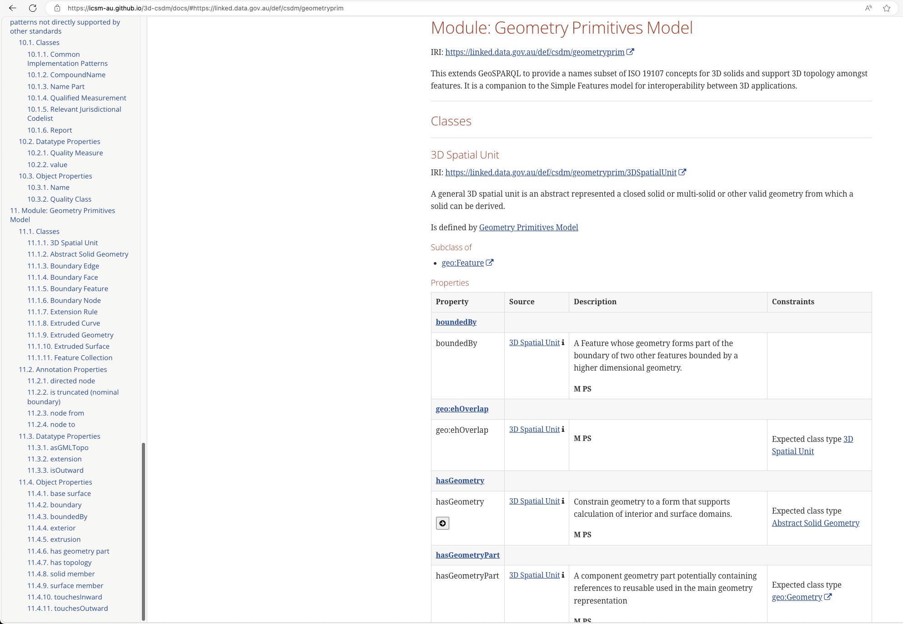
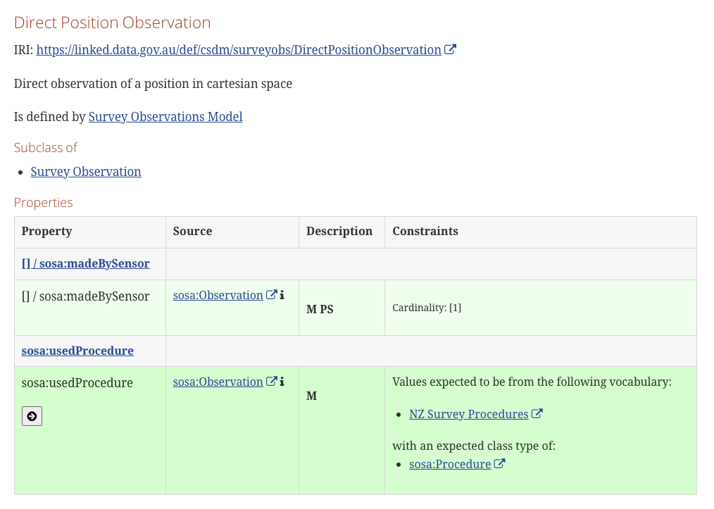

# pyLODE Supermodel

The `supermodel` mode in pyLODE supports documentation for both standalone models and multi-part models, with a particular emphasis on addressing the documentation requirements of modules and profiles within multi-part models.

## Quickstart

Example usage running pyLODE in the `supermodel` mode with the [Exemplification Ontology](https://github.com/Kurrawong/exem-ont).

Running in `supermodel` mode for a standalone `owl:Ontology` model.

> The `supermodel` mode also supports generating multi-part models using terms from the PROF vocabulary. This will be demonstrated a bit later.

```turtle
# ... removed class and property definitions for brevity
# ... only showing the ontology.

ont:
    a owl:Ontology ;
    dcterms:creator <http://orcid.org/0000-0002-8742-7730> ;
    vann:preferredNamespacePrefix "exem" ;
    owl:versionIRI :0.3 ;
    owl:versionInfo "0.3"@en ;
    skos:definition "An ontology for the description of examples."@en ;
    skos:historyNote "This ontology was initially created in 2021 and mostly implemented in 2023 for Australian government data modelling projects that wanted to include examples within the models (ontologies). An update to the model was made to use existing schema.org terminology plus some other bits from DCAT and SKOS." ;
    skos:prefLabel "Exemplification Ontology"@en ;
    sdo:codeRepository "https://github.com/Kurrawong/exem-ont"^^xsd:anyURI ;
    sdo:copyrightHolder <https://kurrawong.ai> ;
    sdo:dateCreated "2021-09-28"^^xsd:date ;
    sdo:dateIssued "2023-06-21"^^xsd:date ;
    sdo:dateModified "2023-06-21"^^xsd:date ;
    sdo:license "https://creativecommons.org/licenses/by/4.0/"^^xsd:anyURI ;
    sdo:publisher <https://kurrawong.ai> ;
    sdo:workExample [
            a sdo:ImageObject ;
            sh:order 0 ;
            sdo:caption "Model overview." ;
            sdo:contentUrl "https://kurrawong.github.io/exem-ont/img/Overview.svg"^^xsd:anyURI ;
            sdo:description "A diagrammatic overview of the model." ;
            sdo:encodingFormat "image/svg+xml" ;
            sdo:name "Model Overview"
        ] ;
.
```

Run pyLODE via the terminal.

```shell
pylode -p supermodel -o index.html https://cdn.jsdelivr.net/gh/kurrawong/exem-ont@bf22aa548c635f43f221df7362d8ddc2d99edcc7/exem.ttl
```

The last positional value can either be a file path or a URL of the model description. In this case, it's a URL of the Exemplification Ontology from a pinned version on a CDN.

## The `supermodel` mode

The `supermodel` mode supports documenting a single ontology or a multi-part ontology described with various standard vocabularies such as OWL, SKOS, DCTERMS, SDO and PROF. The output result is a HTML file with a clean and modern design based on the Asciidoctor stylesheets.

The `supermodel` mode reads a file and must contain either an `owl:Ontology` instance or a `prof:Profile` instance.

With an `owl:Ontology` instance, pyLODE produces an output that is largely the same as the `ontpub` mode but with all of the benefits of the additional functionality added in the `supermodel` mode.

- Customising labels and the ordering of things via a `lode:config` resource
- Adding images and example text using the Exemplification Ontology
- Class properties described using various methods such as schema `domainIncludes` and `rangeIncludes` and also using SHACL class and property shapes.
- Local anchor tags based on the resource's IRI for easier persistent identifier redirection rules
- Interpret vocabulary bindings

### Multi-part models (Supermodels)

A multi-part model, also known as a supermodel, is described using the PROF vocabulary. The initial document passed into pyLODE must only contain one instance of `prof:Profile` and it may contain multiple `prof:ResourceDescriptor` instances to allow pyLODE to import additional descriptions of things within files into pyLODE's graph closure.

#### Resource Descriptors

Any resource descriptor on a profile with one of the following formats will be imported into pyLODE's graph closure.

- text/turtle
- application/n-triples
- application/n-quads

Example resource descriptor:

```turtle
ont:
    a prof:Profile ;
    # ...
    prof:hasResource [
        a prof:ResourceDescriptor ;
        rdfs:label "pylode config" ;
        dcterms:format "text/turtle" ;
        prof:hasRole lode:config ;
        prof:hasArtifact <https://icsm-au.github.io/3d-csdm/pylode.ttl> ;
    ] ;
.
```

#### The `lode:config` role

Notice in the example above, the `prof:ResourceDescriptor` has a role of `lode:config`. This is a special role that instructs pyLODE to load the `prof:Profile` instances found in the resource descriptor into a config graph if the profiles also contain a type of `lode:Module`. This special `lode:Module` class instructs pyLODE that this `prof:Profile` instance is a module (one of the multi-part models) and must be documented as such.

```turtle
:geometryprim
    a prof:Profile ;
    a lode:Module ;
.
```

_A profile instance in the resource descriptor marked as a `lode:Module`._

A profile may contain resource descriptors that contain other profiles. This means that it is valid for a supermodel to recursively load in its resources to expand the pyLODE graph closure until it hits the leaf profiles.

An `sh:order` may exist on a `lode:Module` instance to control the order of the module displayed in the output document.

The output document will contain a section describing all of the classes and properties within that module.



#### The `lode:ignoreClass` property

When a profile is marked as a `lode:Module`, it will extract certain information such as classes and properties and display it in the output document. This may be an issue for users who only want to document a subset of the classes in a module. To resolve this, the `lode:ignoreClass` can be added to a `lode:Module` instance to ignore specific classes.

```turtle
:geometryprim
    a prof:Profile ;
    a lode:Module ;
    # ...
    lode:ignoreClass
        <https://linked.data.gov.au/def/csdm/geometry/ExtensionRule> ,
        <https://linked.data.gov.au/def/csdm/geometry/ExtrudedCurve> ,
        <https://linked.data.gov.au/def/csdm/geometry/ExtrudedGeometry> ,
        <https://linked.data.gov.au/def/csdm/geometry/ExtrudedSurface> ,
        <https://linked.data.gov.au/def/csdm/geometry/FeatureCollection> ;
.
```

#### Notes on publishing profiles

It is best practice as a profile author to omit any statements containing terms from the `lode:` namespace. Any pyLODE specific terms should be imported as a resource descriptor with the `lode:config` role. This way, downstream profiles that profile an existing profile may override certain things or may choose which profiles they want to actually document by tagging them with the `lode:Module` class type.

> Note: In a future version, a `lode:DisabledModule` may be used by downstream users of a profile to disable them if the upstream profile contains a `lode:config` resource descriptor. Alternatively, it may be more appropriate for pyLODE to ignore upstream `lode:config` resource descriptors if it finds a `lode:config` resource descriptor in the entrypoint profile.

### Displaying examples

Text examples and images that provide more context on how a class or property is used can be documented using the [Exemplification Ontology](https://linked.data.gov.au/def/exem). pyLODE will interpret these and format them correctly in the output document. The Exemplification Ontology's documentation is a good example as it is documented using pyLODE.

### Extracting class properties

pyLODE extracts properties using a number of different methods.

#### Class properties - `sdo:domainIncludes`

By adding `sdo:domainIncludes` for each RDF property, pyLODE will extract these terms and add them to the properties table for the respective class. The [Exemplification Ontology](https://linked.data.gov.au/def/exem) uses this method extensively.

#### Class properties - SHACL property shapes

SHACL-based class properties defined as property shapes are extracted in the following ways:

- `sh:property` via an `sh:NodeShape`
- `sh:targetClass`
- implicit target class (node shape that's also an `rdfs:Class`)
- `sh:targetSubjectsOf`
- `sh:targetObjectsOf`

In addition, pyLODE understands both object values and sequence paths for `sh:path`.

An example class with properties described using SHACL, one of which uses a sequence path.



Examples of using SHACL to document the properties of a class are used extensively in the [CSDM Documentation](https://icsm-au.github.io/3d-csdm/docs/).

### Label overrides

Currently, pyLODE in the `supermodel` mode will look at common predicates as labels for resources. These common predicates are:

- `rdfs:label`
- `skos:prefLabel`
- `sdo:name`

> In a future update, label predicates will be configurable via `pylode:config`.

Properties in upstream profiles can have their labels overwritten by providing another label using one of the predicates above in a downstream profile. This is useful when a downstream profile is required to display their own localised label instead of the more general one in the upstream profile.

Likewise, labels can be overwritten if a property is described using SHACL. If the value of the `sh:path` on the SHACL shape contains only one value and the value is not a sequence path, then the label can be overriden by using the `sh:name` predicate.

### Vocabulary bindings

Vocabulary bindings can be associated with classes and properties by providing a small data description using the RDF Data Cube vocabulary.

When processing models, pyLODE will look for properties that are of type `qb:CodedProperty` and if it contains properties such as

Here's an example where we tag the `sosa:usedProcedure` property as of type `qb:CodedProperty`. pyLODE will then look for the following properties:

- `qb:codeList` - the vocabulary IRI, usually a SKOS Concept Scheme
- `rdfs:range` - the class to infer (note this may change in the future as we probably don't want RDFS semantics here but just a way to display what the expected class type is. May use SHACL in the future.)

```turtle
@prefix qb: <http://purl.org/linked-data/cube#> .
@prefix rdfs: <http://www.w3.org/2000/01/rdf-schema#> .
@prefix sh: <http://www.w3.org/ns/shacl#> .
@prefix sosa: <http://www.w3.org/ns/sosa/> .
@prefix vocabs: <https://linked.data.gov.au/def/csdm/> .

sosa:usedProcedure a qb:CodedProperty ;
    qb:codeList vocabs:nz-procedure-used ;
    rdfs:range sosa:Procedure .

vocabs:nz-procedure-used rdfs:label "NZ Survey Procedures" .
sosa:Procedure rdfs:label "Procedure" .
```

The above is rendered in the output document as:


### Debugging

With a complex set of models, sometimes it becomes difficult to debug why the document produced by pyLODE is not what you expected. To get additional information rendered in the document output, supply a statement in the pyLODE config `[] lode:debug true .`.

> Note: pyLODE config is supplied as a `prof:ResourceDescriptor` instance with the role `prof:hasRole lode:config`.
